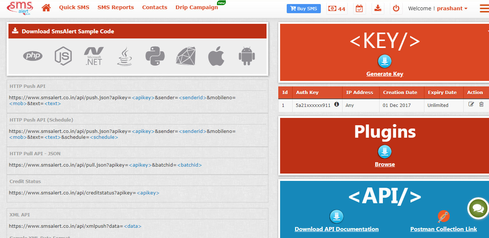
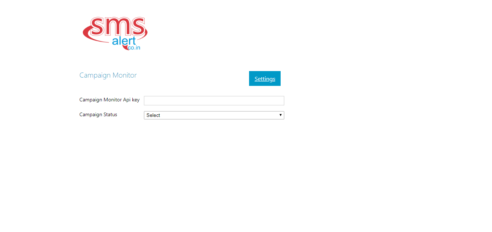
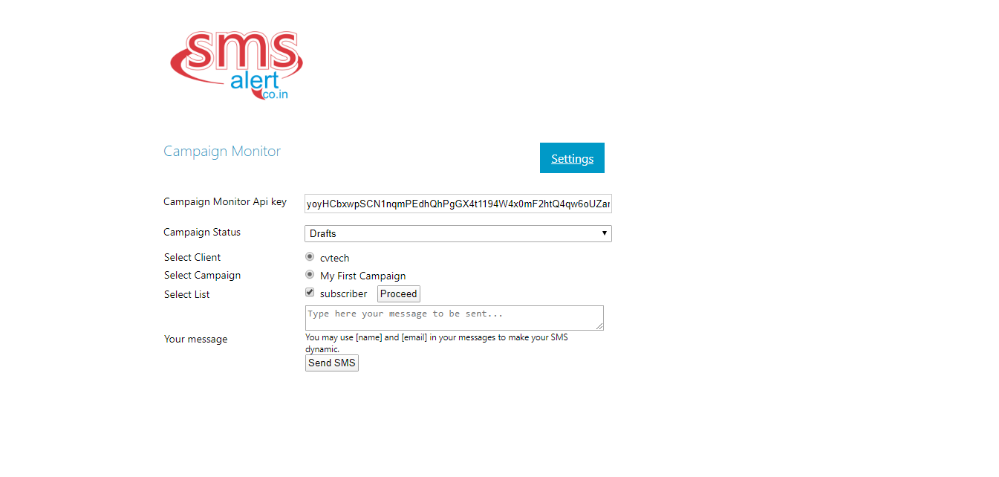

#Campaign Monitor with SMS Alert

##Introduction 

**Campaign Monitor with SMS Alert** app allows users to send SMS to all the subscribers available in the Campaign Monitor email campaign contact list. It helps users to send SMS not only to campaigns in draft status but also to campaigns in sent and scheduled status.

##Use Case

Send SMS to all the clients’ campaign contact list. SMS can be sent to all the contact lists available in a particular campaign.

##Prerequisites

-   SMS Alert subscription and corresponding SMS Alert API key. To get api key register www.smsalert.co.in

-   Campaign Monitor subscription and corresponding Campaign Monitor API key. To access the API key, see appendix (Campaign Monitor API Keys)

-   In Campaign Monitor list, custom field of phone number needs to be added. Name of this field can be added in the settings.

-   In Campaign Monitor list, phone number should be in international format.

##Features

-   Send SMS to all the subscribers available in the Campaign Monitor email campaigns.

-   Customize SMS message with a replaceable parameter of Campaign Monitor list.

##Steps to deploy Campaign Monitor with Nexmo SMS app

1.  Visit the target Git repository using the [URL](https://github.com/Smsalert/Campaign-Monitor-with-SMSAlert.git)

2.  Click on **Download Zip**; app’s Zip file will get downloaded

3.  Extract the app code

4.  Host the downloaded app code with ftp or any other medium

##Steps to configure and use the Campaign Monitor with SMS Alert

1.  Access the Campaign Monitor with SMS Alert using public URL.

2.  Provide your SMS Alert details on the landing page and click on **Update**.

    

3.  Click on Home button from the top right.

4.  You will land on a home page. Here you need to provide your Campaign Monitor Api key and status of the campaign for which you want to send SMS.

    

5.  When you provide the Api key, it will display a list of clients registered with that Api key.

6.  Select the client, it will display campaigns created by that client.

7.  Select any of the campaigns, and it will display lists associated with it.

8.  Select the checkboxes for the lists you want to send SMS to and click on **Proceed**.

9.  A textArea will be displayed, you can type your message here and click on **Send SMS**.

    

##Appendix

SMS Alert API Key
--------------

-   To access the SMS Alert key, go to <https://www.smsalert.co.in/> and sign-in.

-   In menu go to Developer Api >> Generate Key  .

-   Api Key will display in the top bar as shown in the below image:

	

Campaign Monitor API Keys
-------------------------

-   [**Log in**](https://www.campaignmonitor.com/) or [**Sign up**](https://www.campaignmonitor.com/)** .**

-   For new users, a confirmation email will be sent to the registered email ID.

-   Now click on **Clients**.

-   Click on **Account Settings**, in account details section by clicking on **Show API key** link.

-   Copy it and keep it handy.
